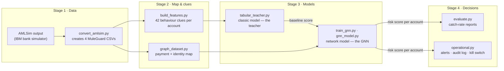

# MuleGuard AI

**Catching money-mule bank accounts with a hybrid tabular + graph-neural-network model — built, evaluated, and honestly reported by me, [Ashutosh Anand](https://github.com/ashutoshanandmehta).**

I'm a final-year BS-MS student in the Department of Economic Sciences at IIT Kanpur. I built
MuleGuard AI to answer a question that sits at the intersection of economics, fraud, and machine
learning: **can a graph neural network, which sees the *network* of payments, catch money mules
that spreadsheet-style models miss?**

📊 **[Live project dashboard](https://ashutoshanandmehta.github.io/Muleguard/)** ·
📄 [Experiment log](HYBRID_TEACHER_FINDINGS.md) · 📐 [Design doc](HYBRID_TEACHER_PLAN.md)

---

## Why I built this

When someone falls for an online scam, the stolen money doesn't go straight to the criminal — it
hops through ordinary-looking **money mule accounts**, gets split up, and exits as cash, crypto,
or UPI transfers within hours. India's I4C identified **26.5 lakh mule accounts** by end-2025, and
the RBI-backed MuleHunter.AI now screens accounts at every major bank. Each mule account passes
normal checks (real person, real KYC, normal balance) — the tell is *behaviour over time and
across the payment network*. That is exactly the kind of signal I wanted to model.

## What I built

A complete, working pipeline — from raw simulated banking data to a ranked list of suspicious
accounts on a fraud analyst's desk — as a local Python CLI:



The part I'm most proud of is the **hybrid tabular-teacher + graph-residual** design: a classic
gradient-boosting model (the *teacher*) scores each account from 42 engineered behaviour clues,
and the GNN starts from that score — its head is zero-initialized and the teacher's logit is added
to its output — so training can only *add* whatever signal the payment network genuinely holds.
The teacher itself is fitted leak-free (train window only, with K-fold out-of-fold scores on its
own training rows), so the comparison stays honest.

## What I found (AMLSim, 100,000 accounts)

Test window: **24,903 accounts, 1,236 real mules** — the newest 20% of the data, unseen during
training. The metric is the one a bank cares about: *if analysts review the top-5% riskiest
accounts, how many real mules are in that pile?*

| Model | Catch rate @5% | ≈ Mules caught per 100 |
|---|---|---|
| Simple rule-based scoring | 0.0502 | ~5 |
| GNN alone (the standard approach) | 0.05–0.06 | ~5–6 |
| Classic model (the teacher) | 0.0647 | ~6.5 |
| **My hybrid (teacher + network)** | **0.0674 ± 0.0010** | **~6.7–6.9** |
| Reference: classic model at a bigger data budget | 0.084 | ~8.4 |

Three findings I stand behind:

1. **The idea works.** The hybrid beat its own teacher in *every* repeated run — the first
   configuration in this project where adding the network helped instead of hurt (vanilla GNNs
   consistently lost to the tabular model).
2. **The simulator ran out of secrets.** The lift was small, and rebuilding the graph around
   transaction nodes with burst-gap timing changed *nothing* — because my 42 engineered clues
   already describe nearly everything AMLSim's rule-based generator produces. The ceiling was the
   data, not the model.
3. **I report the negative results too.** By my own promotion rule (beat the tabular mean by
   +0.03 across seeds), the classic model stays the recommended choice *on this dataset*. Every
   experiment — including the falsified ideas (random-forest teacher, unweighted loss,
   transaction-node view) — is logged in [`HYBRID_TEACHER_FINDINGS.md`](HYBRID_TEACHER_FINDINGS.md)
   and reproducible from checkpoints. On real bank data, where hand-made features are rarely this
   exhaustive, the hybrid is designed to shine — and it's one flag away from re-running.

## Reproduce everything

Requires Python 3.9–3.13 (exactly tested on 3.9.6; `requirements-lock.txt` pins that environment).

```bash
python3 -m venv .venv-ml
.venv-ml/bin/pip install -r requirements.txt   # or requirements-lock.txt for exact pins

# 1. Demo + test suite (36 tests)
.venv-ml/bin/python demo_runner.py
.venv-ml/bin/python -m unittest discover -s tests

# 2. Rebuild engineered features from the committed AMLSim 1K conversion
.venv-ml/bin/python -m muleGuard_ai.build_features \
  --data data/amlsim_1k --output data/amlsim_1k_features

# 3. Train the tabular baseline and the hybrid teacher + graph-residual GNN
.venv-ml/bin/python -m muleGuard_ai.train_baseline_model \
  --data data/amlsim_1k_features \
  --metrics-out runtime/reports/tabular_1k_metrics.json
.venv-ml/bin/python -m muleGuard_ai.train_gnn \
  --transactions data/amlsim_1k_features/muleguard_core_transactions.csv \
  --telemetry data/amlsim_1k_features/muleguard_digital_telemetry.csv \
  --entity-map data/amlsim_1k_features/muleguard_entity_map_full.csv \
  --node-features data/amlsim_1k_features/muleguard_node_features_full.csv \
  --use-tabular-teacher \
  --output models/hybrid_1k.pt

# 4. Evaluate the checkpoint with analyst-queue metrics
.venv-ml/bin/python -m muleGuard_ai.evaluate \
  --data data/amlsim_1k_features \
  --checkpoint models/hybrid_1k.pt \
  --output runtime/reports/hybrid_1k_metrics.json
```

`data/amlsim_1k/` is committed so the full pipeline runs out of the box. It is smoke-scale — its
time-based test slice holds only 6 positive accounts, so treat 1K metrics as plumbing checks. My
100K results require generating AMLSim data externally ([IBM/AMLSim](https://github.com/IBM/AMLSim))
and converting it with `muleGuard_ai.convert_amlsim` (below).

## How the hybrid works

```bash
python -m muleGuard_ai.train_gnn \
  --transactions data/amlsim_1k_features/muleguard_core_transactions.csv \
  --telemetry data/amlsim_1k_features/muleguard_digital_telemetry.csv \
  --entity-map data/amlsim_1k_features/muleguard_entity_map_full.csv \
  --node-features data/amlsim_1k_features/muleguard_node_features_full.csv \
  --use-tabular-teacher \
  --teacher-alpha 1.0 \
  --teacher-model gradient_boosting \
  --ranking-loss-weight 0.2 \
  --output models/account_hybrid.pt
```

`--use-tabular-teacher` fits the teacher on the GNN's train split only (train rows get K-fold
out-of-fold scores, so the feature is non-leaky), then adds `alpha * teacher_logit` to the GNN's
class-1 logit during training *and* inference. The GNN therefore starts at the tabular baseline
and only has to learn residual graph lift. `--teacher-model` accepts `numpy_logistic`,
`logistic`, `random_forest`, or `gradient_boosting`; checkpoints store the fitted teacher, and
every report includes `teacher_test_metrics` — the honest same-slice baseline for my `+0.03`
promotion comparison.

Other training options I built along the way:

- **Architectures** — `hetero_sage`, edge-aware `gatv2`, `edge_transformer`
  (`--architecture`), with residual message passing, input skip, focal or cross-entropy loss,
  balanced class weighting, a sampled pairwise ranking loss, best-validation checkpointing, and
  early stopping.
- **Graph views** (`--graph-view`) — `full` (all entity types), `account_only`, and
  `transaction`, which reifies each transfer as a transaction node
  (`account -> transaction -> account`) carrying
  `[log_amount, log_day_offset, log_gap_since_src_prev_out, log_gap_since_dst_prev_in]` — the
  burst-timing structure direct account edges cannot express. Checkpoints record their graph
  view and inference rebuilds it automatically.
- **Hyperparameter sweeps** — `python -m muleGuard_ai.tune_gnn` grids architectures, losses,
  widths, depths, and learning rates across seeds, compares against the tabular report, and
  writes a `PROMOTE_GNN` / `KEEP_TABULAR` / `NEEDS_MORE_DATA` decision. Teacher flags pass
  through to every config in the sweep.

## Working with AMLSim data

Convert AMLSim outputs (or generator temp outputs) into MuleGuard's four CSVs:

```bash
python -m muleGuard_ai.convert_amlsim \
  --input <path-to-AMLSim>/outputs/1K \
  --output runtime/data/amlsim_1k
```

Build features, score operationally, and evaluate:

```bash
python -m muleGuard_ai.build_features --data runtime/data/amlsim_1k --output runtime/data/amlsim_1k_features

python -m muleGuard_ai.operational \
  --checkpoint models/account_hybrid.pt \
  --model-version hybrid-v1

python -m muleGuard_ai.evaluate \
  --data runtime/data/amlsim_1k_features \
  --checkpoint models/account_hybrid.pt \
  --cutoffs 0.01,0.02,0.05 \
  --calibrate-threshold \
  --output runtime/reports/quality_metrics.json
```

Evaluation reports capture/precision/lift at review cutoffs (my release gate), plus PR-AUC, KS,
confusion matrix, decile tables, error analysis, and per-typology metrics. The multi-model
tabular benchmark (`train_baseline_model --select-best`) compares `numpy_logistic`, `logistic`,
`random_forest`, and `gradient_boosting` across seeds and keeps the winner.

## Operations & governance

`python -m muleGuard_ai.operational` exports ranked alerts (`runtime/alerts/account_alerts.csv`),
a JSONL audit log, and a run report; it supports `--include-allow`, a `--kill-switch`, manual
override CSVs, and records the model version in every alert and audit record. Placeholder
adapters exist for RBIH/MuleHunter, I4C/NCRP, and federated learning. Scenario fixtures under
`data/scenarios/` (digital-arrest, phishing-UPI, loan-app, betting/crypto) can each be scored
directly.

## Tests

```bash
.venv-ml/bin/python -m unittest discover -s tests
```

36 tests, including the leak-freedom invariants of the teacher (out-of-fold scores really are
out-of-fold), the exactness of the hybrid anchor (zero-init head ⇒ epoch-0 model *is* the
teacher), and the transaction-view graph construction. On a NumPy-only interpreter the
GNN-dependent tests skip automatically.

## Limitations I'm upfront about

- **Simulated data** — AMLSim generates fraud from rules my features mirror; real-world lift may
  differ in either direction.
- **Unequal budgets** — the leak-free teacher trains on 60% of accounts vs the 80% reference
  baseline, so those two rows aren't like-for-like.
- **1K is smoke-scale** — 6 test positives; judge nothing on it.
- **Full-batch training** — fine at 100K on a laptop; 1M-scale needs neighbor-sampled batches.
- **Static snapshot** — production would need rolling retraining.

## What I'd do next

1. **Richer data first** — AMLSim's 1M configuration, then real (anonymised) bank data, where
   the payment network still holds signal that engineered features don't already encode.
2. **Rolling time windows** — train, evaluate, and retrain the way a live bank would.

## Author

**Ashutosh Anand** — final-year BS-MS, Department of Economic Sciences, IIT Kanpur.
Project dashboard: **https://ashutoshanandmehta.github.io/Muleguard/**

Built on [IBM/AMLSim](https://github.com/IBM/AMLSim) simulated data. No live bank data was used.
The checked-in sample CSVs are for smoke tests only — real quality claims start at the 100K
experiments documented in [`HYBRID_TEACHER_FINDINGS.md`](HYBRID_TEACHER_FINDINGS.md).

© 2026 Ashutosh Anand. All rights reserved.
